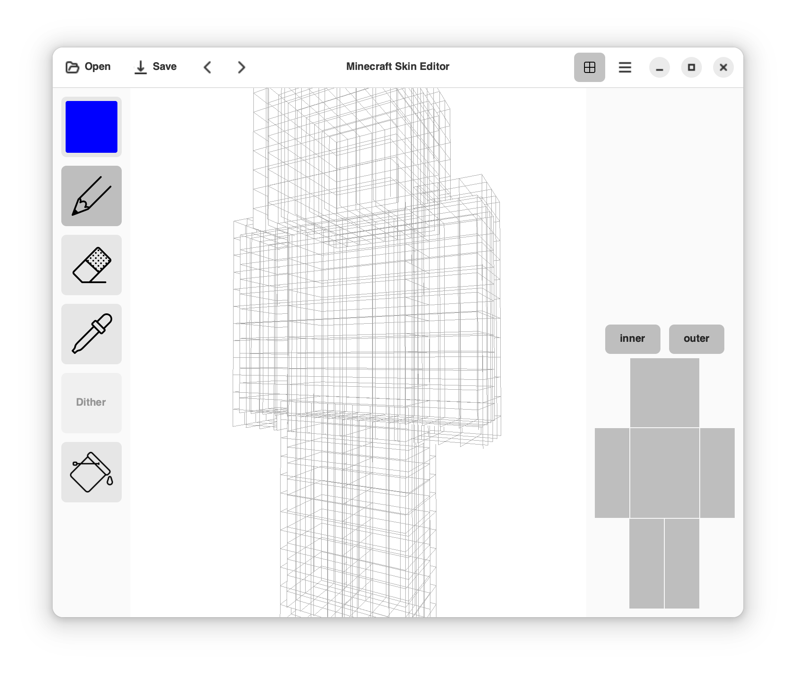

# Minecraft Skin Editor
> ⚠️ **ALPHA version**

### How to run
```shell
$ git clone https://github.com/RedGradient/MinecraftSkinEditor.git
$ cd MinecraftSkinEditor
$ make build
```

### Known issues
* Artifacts on the model
* Bad performance of drawing
* Grid for slim model has cut edges
