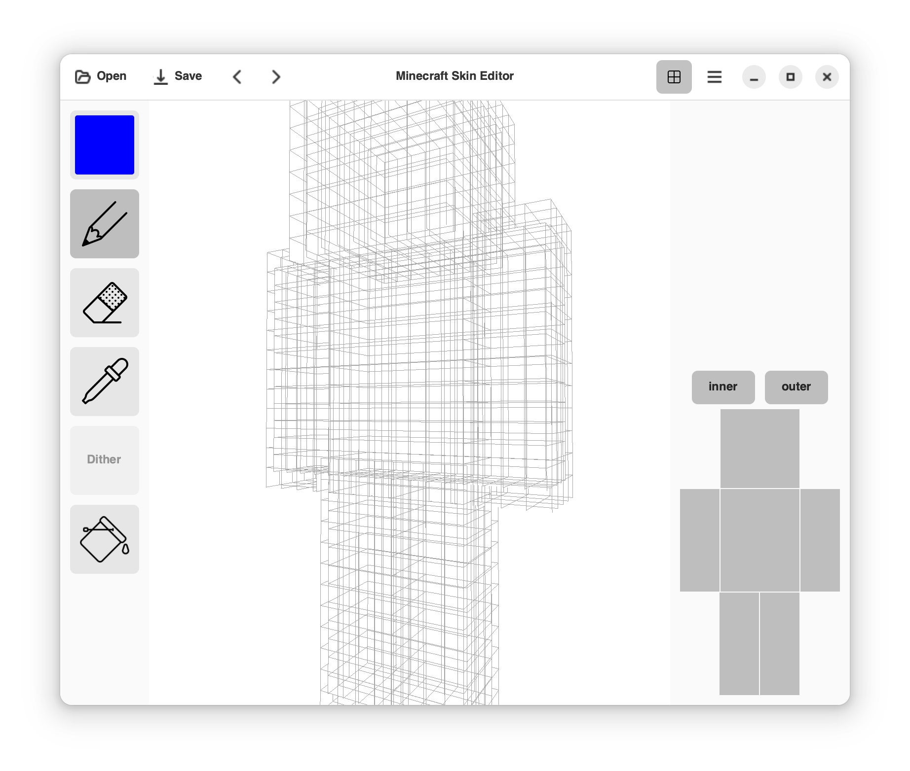

# Minecraft Skin Editor

> ⚠️ **ALPHA version**

## Run

### Prerequisites

- Rust ≥ 1.92
- GTK ≥ 4.16 and Libadwaita ≥ 1.6 (development packages)
- `pkg-config`

**macOS** (Homebrew):

```shell
brew install pkg-config gtk4 libadwaita
```

**Debian / Ubuntu** (needs a release with GTK 4.16+, e.g. Ubuntu 24.10+; 24.04 LTS is too old):

```shell
sudo apt install build-essential pkg-config libgtk-4-dev libadwaita-1-dev
```

**Fedora**:

```shell
sudo dnf install gcc pkgconf-pkg-config gtk4-devel libadwaita-devel
```

### Build and run

```shell
git clone https://github.com/RedGradient/MinecraftSkinEditor.git
cd MinecraftSkinEditor
make run
```

`make run` compiles GResource assets and starts the app with `cargo run`.
