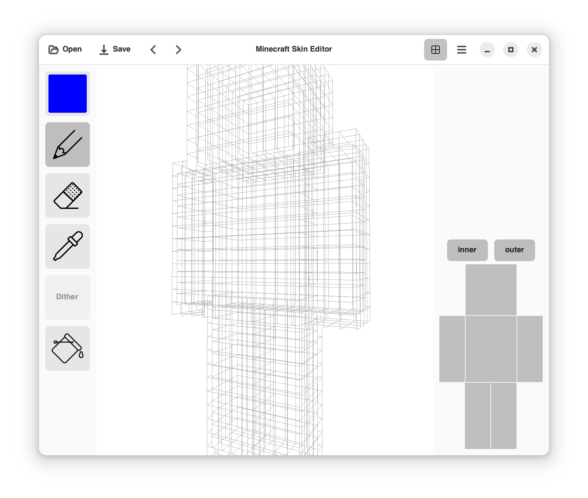

# Minecraft Skin Editor

> ⚠️ **ALPHA version**

## Run

### Prerequisites

- Rust ≥ 1.92
- GTK ≥ 4.16 and Libadwaita ≥ 1.6 (development packages)
- `pkg-config`
- `blueprint-compiler` ≥ 0.22

See the official [Blueprint installation instructions](https://gnome.pages.gitlab.gnome.org/blueprint-compiler/setup.html).
Blueprint Compiler can also be installed from PyPI:

```shell
python3 -m pip install --user blueprint-compiler
```

**macOS** (Homebrew):

```shell
brew install pkg-config gtk4 libadwaita libepoxy
```

**Debian / Ubuntu** (needs a release with GTK 4.16+, e.g. Ubuntu 24.10+; 24.04 LTS is too old for now, but requirements are expected to be lowered soon):

```shell
sudo apt install build-essential pkg-config libgtk-4-dev libadwaita-1-dev libssl-dev libepoxy-dev blueprint-compiler
```

**Fedora**:

```shell
sudo dnf install gcc pkgconf-pkg-config gtk4-devel libadwaita-devel openssl-devel libepoxy-devel blueprint-compiler
```

### Build and run

```shell
git clone https://github.com/RedGradient/MinecraftSkinEditor.git
cd MinecraftSkinEditor
make run
```

`make run` compiles Blueprint sources from `resources/blueprints` into GtkBuilder
files in `resources/ui`, compiles GResource assets, and starts the app with
`cargo run`.
