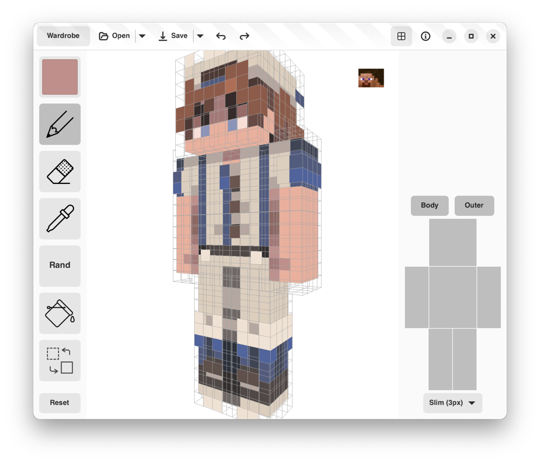

[//]: # (![MCSkinEditor UI]&#40;resources/screenshot-1.png&#41;)

[//]: # (![MCSkinEditor UI]&#40;resources/screenshot-2.png&#41;)

<p float="left">
  
   
</p>

# Minecraft Skin Editor
> ⚠️ **ALPHA version**

### How to run
```shell
$ git clone https://github.com/RedGradient/MinecraftSkinEditor.git
$ cd MinecraftSkinEditor
$ make build
```

### Known issues
* Artifacts on the model
* Grid for slim model has cut edges
